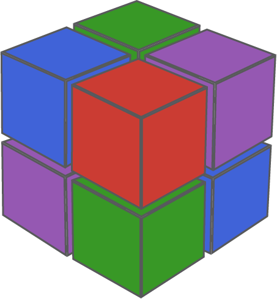
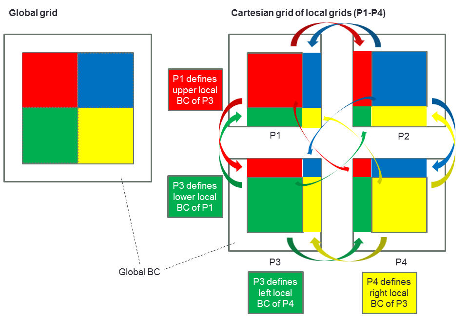

<h1>  ImplicitGlobalGrid.jl </h1>

[](https://github.com/eth-cscs/ImplicitGlobalGrid.jl/actions/workflows/CI.yml?query=branch%3Amain)
[](https://codecov.io/gh/omlins/ImplicitGlobalGrid.jl)

ImplicitGlobalGrid is an outcome of a collaboration of the Swiss National Supercomputing Centre, ETH Zurich (Dr. Samuel Omlin) with Stanford University (Dr. Ludovic Räss) and the Swiss Geocomputing Centre (Prof. Yuri Podladchikov). It renders the distributed parallelization of stencil-based GPU and CPU applications on a regular staggered grid almost trivial and enables close to ideal weak scaling of real-world applications on thousands of GPUs \[[1][JuliaCon19], [2][PASC19], [3][JuliaCon20a]\]:


ImplicitGlobalGrid relies on the Julia MPI wrapper ([MPI.jl]) to perform halo updates close to hardware limit and leverages CUDA-aware or ROCm-aware MPI for GPU-applications. The communication can straightforwardly be hidden behind computation \[[1][JuliaCon19], [3][JuliaCon20a]\] (how this can be done automatically when using ParallelStencil.jl is shown in \[[3][JuliaCon20a]\]; a general approach particularly suited for CUDA C applications is explained in \[[4][GTC19]\]).

A particularity of ImplicitGlobalGrid is the automatic *implicit creation of the global computational grid* based on the number of processes the application is run with (and based on the process topology, which can be explicitly chosen by the user or automatically defined). As a consequence, the user only needs to write a code to solve his problem on one GPU/CPU (*local grid*); then, **as little as three functions can be enough to transform a single GPU/CPU application into a massively scaling Multi-GPU/CPU application**. See the [example](#multi-gpu-with-three-functions) below. 1-D, 2-D and 3-D grids are supported. Here is a sketch of the global grid that results from running a 2-D solver with 4 processes (P1-P4) (a 2x2 process topology is created by default in this case):



## Contents
* [Multi-GPU with three functions](#multi-gpu-with-three-functions)
* [50-lines Multi-GPU example](#50-lines-multi-gpu-example)
* [Straightforward in-situ visualization / monitoring](#straightforward-in-situ-visualization--monitoring)
* [Seamless interoperability with MPI.jl](#seamless-interoperability-with-mpijl)
* [CUDA-aware/ROCm-aware MPI support](#cuda-awarerocm-aware-mpi-support)
* [Module documentation callable from the Julia REPL / IJulia](#module-documentation-callable-from-the-julia-repl--ijulia)
* [Dependencies](#dependencies)
* [Installation](#installation)
* [Questions, comments and discussions](#questions-comments-and-discussions)
* [Your contributions](#your-contributions)
* [References](#references)

## Multi-GPU with three functions
Only three functions are required to perform halo updates close to hardware limit:
- `init_global_grid`
- `update_halo!`
- `finalize_global_grid`

Three additional functions are provided to query Cartesian coordinates with respect to the global computational grid if required:
- `x_g`
- `y_g`
- `z_g`

Moreover, the following three functions allow to query the size of the global grid:
- `nx_g`
- `ny_g`
- `nz_g`

The following Multi-GPU 3-D heat diffusion solver illustrates how these functions enable the creation of massively parallel applications.

## 50-lines Multi-GPU example
This simple Multi-GPU 3-D heat diffusion solver uses ImplicitGlobalGrid. It relies fully on the broadcasting capabilities of [CUDA.jl]'s `CuArray` type to perform the stencil-computations with maximal simplicity ([CUDA.jl] enables also writing explicit GPU kernels which can lead to significantly better performance for these computations).
```julia
using CUDA                # Import CUDA before ImplicitGlobalGrid to activate its CUDA device support
using ImplicitGlobalGrid

@views d_xa(A) = A[2:end  , :     , :     ] .- A[1:end-1, :     , :     ];
@views d_xi(A) = A[2:end  ,2:end-1,2:end-1] .- A[1:end-1,2:end-1,2:end-1];
@views d_ya(A) = A[ :     ,2:end  , :     ] .- A[ :     ,1:end-1, :     ];
@views d_yi(A) = A[2:end-1,2:end  ,2:end-1] .- A[2:end-1,1:end-1,2:end-1];
@views d_za(A) = A[ :     , :     ,2:end  ] .- A[ :     , :     ,1:end-1];
@views d_zi(A) = A[2:end-1,2:end-1,2:end  ] .- A[2:end-1,2:end-1,1:end-1];
@views  inn(A) = A[2:end-1,2:end-1,2:end-1]

@views function diffusion3D()
    # Physics
    lam        = 1.0;                                       # Thermal conductivity
    cp_min     = 1.0;                                       # Minimal heat capacity
    lx, ly, lz = 10.0, 10.0, 10.0;                          # Length of domain in dimensions x, y and z

    # Numerics
    nx, ny, nz = 256, 256, 256;                             # Number of gridpoints dimensions x, y and z
    nt         = 100000;                                    # Number of time steps
    init_global_grid(nx, ny, nz);                           # Initialize the implicit global grid
    dx         = lx/(nx_g()-1);                             # Space step in dimension x
    dy         = ly/(ny_g()-1);                             # ...        in dimension y
    dz         = lz/(nz_g()-1);                             # ...        in dimension z

    # Array initializations
    T     = CUDA.zeros(Float64, nx,   ny,   nz  );
    Cp    = CUDA.zeros(Float64, nx,   ny,   nz  );
    dTedt = CUDA.zeros(Float64, nx-2, ny-2, nz-2);
    qx    = CUDA.zeros(Float64, nx-1, ny-2, nz-2);
    qy    = CUDA.zeros(Float64, nx-2, ny-1, nz-2);
    qz    = CUDA.zeros(Float64, nx-2, ny-2, nz-1);

    # Initial conditions (heat capacity and temperature with two Gaussian anomalies each)
    Cp .= cp_min .+ CuArray([5*exp(-((x_g(ix,dx,Cp)-lx/1.5))^2-((y_g(iy,dy,Cp)-ly/2))^2-((z_g(iz,dz,Cp)-lz/1.5))^2) +
                             5*exp(-((x_g(ix,dx,Cp)-lx/3.0))^2-((y_g(iy,dy,Cp)-ly/2))^2-((z_g(iz,dz,Cp)-lz/1.5))^2) for ix=1:size(T,1), iy=1:size(T,2), iz=1:size(T,3)])
    T  .= CuArray([100*exp(-((x_g(ix,dx,T)-lx/2)/2)^2-((y_g(iy,dy,T)-ly/2)/2)^2-((z_g(iz,dz,T)-lz/3.0)/2)^2) +
                    50*exp(-((x_g(ix,dx,T)-lx/2)/2)^2-((y_g(iy,dy,T)-ly/2)/2)^2-((z_g(iz,dz,T)-lz/1.5)/2)^2) for ix=1:size(T,1), iy=1:size(T,2), iz=1:size(T,3)])

    # Time loop
    dt = min(dx*dx,dy*dy,dz*dz)*cp_min/lam/8.1;                                               # Time step for the 3D Heat diffusion
    for it = 1:nt
        qx    .= -lam.*d_xi(T)./dx;                                                           # Fourier's law of heat conduction: q_x   = -λ δT/δx
        qy    .= -lam.*d_yi(T)./dy;                                                           # ...                               q_y   = -λ δT/δy
        qz    .= -lam.*d_zi(T)./dz;                                                           # ...                               q_z   = -λ δT/δz
        dTedt .= 1.0./inn(Cp).*(-d_xa(qx)./dx .- d_ya(qy)./dy .- d_za(qz)./dz);               # Conservation of energy:           δT/δt = 1/cₚ (-δq_x/δx - δq_y/dy - δq_z/dz)
        T[2:end-1,2:end-1,2:end-1] .= inn(T) .+ dt.*dTedt;                                    # Update of temperature             T_new = T_old + δT/δt
        update_halo!(T);                                                                      # Update the halo of T
    end

    finalize_global_grid();                                                                   # Finalize the implicit global grid
end

diffusion3D()
```

The corresponding file can be found [here](docs/examples/diffusion3D_multigpu_CuArrays_novis.jl). A basic cpu-only example is available [here](docs/examples/diffusion3D_multicpu_novis.jl) (no usage of multi-threading).

## Straightforward in-situ visualization / monitoring
ImplicitGlobalGrid provides a function to gather an array from each process into a one large array on a single process, assembled according to the global grid:
- `gather!`

This enables straightforward in-situ visualization or monitoring of Multi-GPU/CPU applications using e.g. the [Julia Plots package] as shown in the following (the GR backend is used as it is particularly fast according to the [Julia Plots documentation]). It is enough to add a couple of lines to the previous example (omitted unmodified lines are represented with `#(...)`):
```julia
using CUDA                       # Import CUDA before ImplicitGlobalGrid to activate its CUDA device support
using ImplicitGlobalGrid, Plots
#(...)

@views function diffusion3D()
    # Physics
    #(...)

    # Numerics
    #(...)
    me, dims   = init_global_grid(nx, ny, nz);              # Initialize the implicit global grid
    #(...)

    # Array initializations
    #(...)

    # Initial conditions (heat capacity and temperature with two Gaussian anomalies each)
    #(...)

    # Preparation of visualisation
    gr()
    ENV["GKSwstype"]="nul"
    anim = Animation();
    nx_v = (nx-2)*dims[1];
    ny_v = (ny-2)*dims[2];
    nz_v = (nz-2)*dims[3];
    T_v  = zeros(nx_v, ny_v, nz_v);
    T_nohalo = zeros(nx-2, ny-2, nz-2);

    # Time loop
    #(...)
    for it = 1:nt
        if mod(it, 1000) == 1                                                                 # Visualize only every 1000th time step
            T_nohalo .= Array(T[2:end-1,2:end-1,2:end-1]);                                    # Copy data to CPU removing the halo
            gather!(T_nohalo, T_v)                                                            # Gather data on process 0 (could be interpolated/sampled first)
            if (me==0) heatmap(transpose(T_v[:,ny_v÷2,:]), aspect_ratio=1); frame(anim); end  # Visualize it on process 0
        end
        #(...)
    end

    # Postprocessing
    if (me==0) gif(anim, "diffusion3D.gif", fps = 15) end                                     # Create a gif movie on process 0
    if (me==0) mp4(anim, "diffusion3D.mp4", fps = 15) end                                     # Create a mp4 movie on process 0
    finalize_global_grid();                                                                   # Finalize the implicit global grid
end

diffusion3D()
```

Here is the resulting movie when running the application on 8 GPUs, solving 3-D heat diffusion with heterogeneous heat capacity (two Gaussian anomalies) on a global computational grid of size 510x510x510 grid points. It shows the x-z-dimension plane in the middle of the dimension y:


The simulation producing this movie - *including the in-situ visualization* - took 29 minutes on 8 NVIDIA® Tesla® P100 GPUs on Piz Daint (an optimized solution using [CUDA.jl]'s native kernel programming capabilities can be more than 10 times faster).
The complete example can be found [here](docs/examples/diffusion3D_multigpu_CuArrays.jl). A corresponding basic cpu-only example is available [here](docs/examples/diffusion3D_multicpu.jl) (no usage of multi-threading) and a movie of a simulation with 254x254x254 grid points which it produced within 34 minutes using 8 Intel® Xeon® E5-2690 v3 is found [here](docs/src/assets/videos/diffusion3D_8cpus.gif) (with 8 processes, no multi-threading).

## Seamless interoperability with MPI.jl
ImplicitGlobalGrid is seamlessly interoperable with [MPI.jl]. The Cartesian MPI communicator it uses is created by default when calling `init_global_grid` and can then be obtained as follows (variable `comm_cart`):
```julia
me, dims, nprocs, coords, comm_cart = init_global_grid(nx, ny, nz);
```
Moreover, the automatic initialization and finalization of MPI can be deactivated in order to replace them with direct calls to [MPI.jl]:
```julia
init_global_grid(nx, ny, nz; init_MPI=false);
```
```julia
finalize_global_grid(;finalize_MPI=false)
```
Besides, `init_global_grid` makes every argument it passes to an [MPI.jl] function customizable via its keyword arguments.

## CUDA-aware/ROCm-aware MPI support
If the system supports CUDA-aware/ROCm-aware MPI, it may be activated for ImplicitGlobalGrid by setting an environment variable as specified in the module documentation callable from the [Julia REPL] or in [IJulia] (see next section).

## Module documentation callable from the Julia REPL / IJulia
The module documentation can be called from the [Julia REPL] or in [IJulia]:
```julia-repl
julia> using ImplicitGlobalGrid
julia>?
help?> ImplicitGlobalGrid
search: ImplicitGlobalGrid

  Module ImplicitGlobalGrid

  Renders the distributed parallelization of stencil-based GPU and CPU applications on a
  regular staggered grid almost trivial and enables close to ideal weak scaling of
  real-world applications on thousands of GPUs.

  General overview and examples
  ≡≡≡≡≡≡≡≡≡≡≡≡≡≡≡≡≡≡≡≡≡≡≡≡≡≡≡≡≡≡≡

  https://github.com/eth-cscs/ImplicitGlobalGrid.jl

  Functions
  ≡≡≡≡≡≡≡≡≡≡≡

    •    init_global_grid

    •    finalize_global_grid

    •    update_halo!

    •    gather!

    •    select_device

    •    nx_g

    •    ny_g

    •    nz_g

    •    x_g

    •    y_g

    •    z_g

    •    tic

    •    toc

  To see a description of a function type ?<functionname>.

  │ Activation of device support
  │
  │  The support for a device type (CUDA or AMDGPU) is activated by importing the corresponding module (CUDA or AMDGPU) before
  │  importing ImplicitGlobalGrid (the corresponding extension will be loaded).

  │ Performance note
  │
  │  If the system supports CUDA-aware MPI (for Nvidia GPUs) or ROCm-aware MPI (for AMD GPUs), it may be activated for
  │  ImplicitGlobalGrid by setting one of the following environment variables (at latest before the call to init_global_grid):
  │
  │  shell> export IGG_CUDAAWARE_MPI=1
  │
  │  shell> export IGG_ROCMAWARE_MPI=1

julia>
```

## Dependencies
ImplicitGlobalGrid relies on the Julia MPI wrapper ([MPI.jl]), the Julia CUDA package ([CUDA.jl] \[[5][Julia CUDA paper 1], [6][Julia CUDA paper 2]\]) and the Julia AMDGPU package ([AMDGPU.jl]).

## Installation
ImplicitGlobalGrid may be installed directly with the [Julia package manager](https://docs.julialang.org/en/v1/stdlib/Pkg/index.html) from the REPL:
```julia-repl
julia>]
  pkg> add ImplicitGlobalGrid
  pkg> test ImplicitGlobalGrid
```

## Questions, comments and discussions
To discuss technical issues, please post on Julia Discourse in the [GPU topic] or the [Julia at Scale topic] or in the `#gpu` or `#hpc` channels on the [Julia Slack] (to join, visit https://julialang.org/slack/).
To discuss numerical/domain-science issues, please post on Julia Discourse in the [Numerics topic] or the [Modelling & Simulations topic] or whichever other topic fits best your issue.

## Your contributions
This project welcomes your contribution! Have you developed an application with ImplicitGlobalGrid that could be featured as an example? Please contribute it to share it with the world (if your application uses also ParallelStencil then contribute it as a mini-app in the corresponding repository)! Are you missing a convenience feature (like `ImplicitGlobalGrid.gather!`)? Then write it using MPI and contribute it to ImplicitGlobalGrid! Are you missing a great feature in the core of ImplicitGlobalGrid? Maybe you can contribute yourself!
Please open an issue to discuss your idea for a contribution beforehand. Furthermore, note that a pull request should always address an issue in its completeness. Moreover, pull requests should blend nicely into the existing project; common sense is the primary guide in this regard (community guideline documents, e.g. [ColPrac](https://github.com/SciML/ColPrac), can be consulted in addition for inspiration). We are looking forward to your contribution!

## References
\[1\] [Räss, L., Omlin, S., & Podladchikov, Y. Y. (2019). Porting a Massively Parallel Multi-GPU Application to Julia: a 3-D Nonlinear Multi-Physics Flow Solver. JuliaCon Conference, Baltimore, USA.][JuliaCon19]

\[2\] [Räss, L., Omlin, S., & Podladchikov, Y. Y. (2019). A Nonlinear Multi-Physics 3-D Solver: From CUDA C + MPI to Julia. PASC19 Conference, Zurich, Switzerland.][PASC19]

\[3\] [Omlin, S., Räss, L., Kwasniewski, G., Malvoisin, B., & Podladchikov, Y. Y. (2020). Solving Nonlinear Multi-Physics on GPU Supercomputers with Julia. JuliaCon Conference, virtual.][JuliaCon20a]

\[4\] [Räss, L., Omlin, S., & Podladchikov, Y. Y. (2019). Resolving Spontaneous Nonlinear Multi-Physics Flow Localisation in 3-D: Tackling Hardware Limit. GPU Technology Conference 2019, San Jose, Silicon Valley, CA, USA.][GTC19]

\[5\] [Besard, T., Foket, C., & De Sutter, B. (2018). Effective Extensible Programming: Unleashing Julia on GPUs. IEEE Transactions on Parallel and Distributed Systems, 30(4), 827-841. doi: 10.1109/TPDS.2018.2872064][Julia CUDA paper 1]

\[6\] [Besard, T., Churavy, V., Edelman, A., & De Sutter B. (2019). Rapid software prototyping for heterogeneous and distributed platforms. Advances in Engineering Software, 132, 29-46. doi: 10.1016/j.advengsoft.2019.02.002][Julia CUDA paper 2]

[JuliaCon20a]: https://www.youtube.com/watch?v=vPsfZUqI4_0
[JuliaCon19]: https://pretalx.com/juliacon2019/talk/LGHLC3/
[PASC19]: https://pasc19.pasc-conference.org/program/schedule/presentation/?id=msa218&sess=sess144
[GTC19]: https://on-demand.gputechconf.com/gtc/2019/video/_/S9368/
[MPI.jl]: https://github.com/JuliaParallel/MPI.jl
[CUDA.jl]: https://github.com/JuliaGPU/CUDA.jl
[AMDGPU.jl]: https://github.com/JuliaGPU/AMDGPU.jl
[Julia Plots package]: https://github.com/JuliaPlots/Plots.jl
[Julia Plots documentation]: http://docs.juliaplots.org/latest/backends/
[Julia CUDA paper 1]: https://doi.org/10.1109/TPDS.2018.2872064
[Julia CUDA paper 2]: https://doi.org/10.1016/j.advengsoft.2019.02.002
[Julia REPL]: https://docs.julialang.org/en/v1/stdlib/REPL/
[IJulia]: https://github.com/JuliaLang/IJulia.jl
